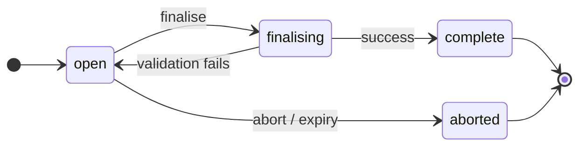

# Depositing

A deposit is a session: open it, stage an RO-Crate and files, finalise. The
storage object comes into existence only at the first successful finalise —
until then nothing is readable and no entities exist. This page walks the
whole flow for a new storage object; [updating an existing
one](./updating) uses the same staging surface with a different entry point.

The deposit's lifecycle:



Deposits are single-use: once `complete`, further changes open a new deposit.

## 1. Check the Capability

Read [`/capabilities`](/docs/getting-started/capabilities) and confirm
`"deposit" in capabilities.extensions`. Note the declared `idMinting` mode
and `fileUpload` modes — they decide the shape of the calls below. All
deposit calls require the `write` scope.

## 2. Create the Deposit

```http
POST /deposits
Content-Type: application/json

{ "storageObjectId": "https://catalog.paradisec.org.au/repository/NT1/001" }
```

The `storageObjectId` in the body is a proposal, allowed when `idMinting` is
`client` or `both`. Omit the body (or the field) and the server mints an ID
(`server` or `both`). Proposing an ID the declared mode does not support is
rejected with `422`; proposing one that already exists is rejected with
`409` — which also catches the typo'd-ID footgun of aiming a fresh deposit
at an ID you meant to [update](./updating).

```json
{
  "depositId": "dep_8f14e45f",
  "storageObjectId": "https://catalog.paradisec.org.au/repository/NT1/001",
  "state": "open"
}
```

The response (`201`, with a `Location` header for the deposit) returns the
storage-object ID immediately, so you can reference it from the crate you are
about to stage. Whether the crate MUST reference it is implementation-defined
and enforced at finalise.

## 3. Stage the Crate

```http
PUT /deposit/dep_8f14e45f/crate
Content-Type: application/ld+json

{ "@context": "https://w3id.org/ro/crate/1.2/context", "@graph": [ ... ] }
```

Staging the crate is a **full replace** — staging again discards the earlier
crate; there is no crate PATCH and no crate DELETE. Crate and files may be
staged in **any order**; the crate–file association is only checked at
finalise.

At finalise the staged crate becomes the storage object's authoritative file
manifest: every file the new version holds is a file entity in this crate.

## 4. Stage the Files

Files are staged at `PUT /deposit/{id}/file/{fileId}`, where `{fileId}` is
the file entity's `@id` in the crate, percent-encoded — for attached files,
its crate-relative path. Two modes share the endpoint, discriminated by the
request `Content-Type`; use the ones the implementation declares in
`fileUpload`. Only transport metadata travels here — descriptive metadata
about the file lives in the crate.

### Inline mode

The request body is the file's bytes, sent with the file's own media type:

```http
PUT /deposit/dep_8f14e45f/file/NT1-001-001A.wav
Content-Type: audio/x-wav

<bytes>
```

Responds `204`. Suited to modest files and simple clients.

### Presigned mode

The request body is JSON transport metadata, and the response is an upload
target the client sends the bytes to directly — typically a presigned
object-store URL:

```http
PUT /deposit/dep_8f14e45f/file/NT1-001-001A.wav
Content-Type: application/json

{
  "size": 2048576,
  "checksum": "sha256:9f86d081884c7d659a2feaa0c55ad015a3bf4f1b2b0b822cd15d6c15b0f00a08",
  "mediaType": "audio/x-wav"
}
```

Responds `200` with the upload target:

```json
{
  "uploadUrl": "https://uploads.example.org/deposit/dep_8f14e45f/NT1-001-001A.wav?signature=...",
  "method": "PUT",
  "headers": { "Content-Type": "audio/x-wav" },
  "expiresAt": "2026-07-22T10:00:00Z"
}
```

Upload the bytes to `uploadUrl` with the given method and headers before
`expiresAt` (re-stage the file to obtain a fresh target). There is **no
per-file completion call**: finalise verifies that the bytes landed and
match the declared size and checksum. A missing or mismatched upload is a
validation violation at finalise — re-upload just that file and finalise
again.

### Housekeeping

- Staging the same `{fileId}` again replaces the earlier staging, in either
  mode.
- `DELETE /deposit/{id}/file/{fileId}` removes a staged file while the
  deposit is `open`.
- `GET /deposit/{id}` lists the staged files with per-file status —
  `pending` (presigned, bytes not yet observed) or `received`. Status MAY be
  updated eagerly or lazily; finalise remains the authoritative
  verification point.
- Files exceeding a declared `maxFileSizeBytes` are rejected with `413`.

## 5. Finalise

```http
POST /deposit/dep_8f14e45f/finalise
```

Finalise validates the staged content, publishes it as the storage object's
new current version, and materialises catalog entities from it. Validation
depth and materialisation rules are implementation-defined.

The server MAY complete synchronously or asynchronously, **at its own
discretion per request** — there is no capability flag, and one client code
path handles both:

- **`200`**: the deposit is returned in state `complete`. Done.
- **`202`**: the deposit is returned in state `finalising`. Poll
  `GET /deposit/{id}` until the state leaves `finalising`.

```
finalise → state?
  complete   → done
  finalising → poll GET /deposit/{id} until the state changes
  open       → a failure was recorded in `errors`; fix and retry
```

The finalise response is always the thin deposit representation. On
`complete` it carries the `storageObjectId`; the materialised-entity list
lives on the storage object itself, because later deposits can change it.

### When finalise fails

**Failure atomicity is guaranteed**: a finalise that does not reach
`complete` leaves no observable change — the storage object stays at its
prior version (or, for a create deposit, does not come into existence) and
no entities are touched. Retry is always safe.

- **Validation failure** returns the deposit to `open` with the violations
  recorded — as a `422` body on the synchronous path, and in the deposit's
  `errors` field (readable via `GET /deposit/{id}`) on the asynchronous
  path. Same violations shape either way. Staged content is intact: a
  metadata typo never forces re-uploading media — fix the crate, re-stage
  it, finalise again. `errors` is cleared when the next finalise is
  accepted.
- **Non-validation failure** (materialisation crash, backend outage, or the
  target storage object having been [deleted
  mid-deposit](./lifecycle#open-deposits-when-the-object-is-deleted)) also
  returns the deposit to `open` with the failure recorded; the synchronous
  path gets a `5xx`. There is no terminal `failed` state — retry, or abort
  to walk away.

Once `complete`, the new crate and all materialised entities are readable.
Readers are not guaranteed to observe the transition as a single atomic
flip; implementations should minimise the window (for example by flipping
the crate pointer last).

## 6. See What Was Materialised

```http
GET /storage-object/https%3A%2F%2Fcatalog.paradisec.org.au%2Frepository%2FNT1%2F001
```

```json
{
  "id": "https://catalog.paradisec.org.au/repository/NT1/001",
  "entityIds": [
    "https://catalog.paradisec.org.au/repository/NT1/001",
    "https://catalog.paradisec.org.au/repository/NT1/001/NT1-001-001A.wav"
  ],
  "createdAt": "2026-07-21T04:12:00Z",
  "lastDepositedAt": "2026-07-21T04:12:00Z",
  "access": { "metadata": true, "content": true }
}
```

`entityIds` is the authoritative "what did my deposit create". The deposited
crate — [`GET /storage-object/{id}/crate`](/docs/api/get-storage-object-crate) —
is the single source of truth for the object's content inventory; the
storage object carries no file list of its own.

## Abort and Expiry

`DELETE /deposit/{id}` aborts an `open` deposit, discarding its staged crate
and files. Aborting is terminal; the storage object is left at its prior
version, or never comes into existence for a create deposit.

Abandoned deposits are subject to implementation-defined expiry — an expired
deposit behaves as aborted, and subsequent access MAY return `404`. Where
the implementation declares `depositTtlSeconds`, that is the expiry horizon.
